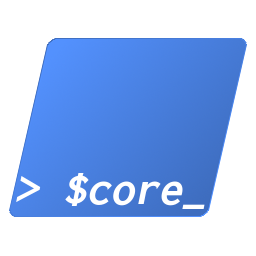

# PwSh.Fw.Core

PwSh Framework core module.

New era of `pwsh_fw` framework for PowerShell. The future of this framework will be available as modules deployed via [PowerShell Gallery](https://www.powershellgallery.com/). It will also be splitted in pieces to make it very modular.

## Content

`PwSh.Fw.Core` as its name suggest contain the core of the `PwSh` framework. All `PwSh.Fw` modules require `PwSh.Fw.Core`. It implements all the basics of the framework like displaying messages or debugging scripts.

## Highlights

-	`New-Function` is a template to create new functions. You can copy-paste the
    code, or your can use the code to create a snippet for VisualStudioCode for
    example.
-   `Write-*` are functions to display piece of information. It is similar to
    using `Write-Debug` or `Write-Information` or the like, but the display is
    inpired from `e*()` functions of the `gentoo` linux distribution. Information
    displayed is more human-readable.
-   `Load-Module` is a wrapper to `Import-Module`. It handle missing module, can
    make a module optional, and handle proper logging.
-   `Execute-Command` is a wrapper to execute native OS programs. It handles
    proper logging, arguments and return code.
